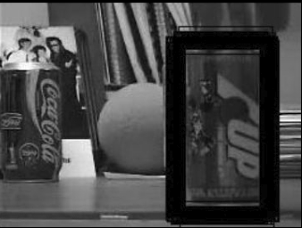
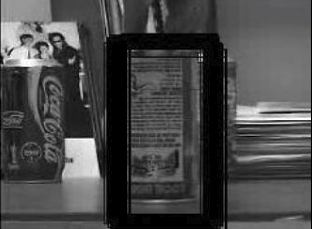

# VIDEO OBJECT SURVEILLANCE

## Intro

The goal of this work is to visually monitor a can of soft drink in successive frames. For this purpose a tracking algorithm was implemented using a particle filter. The observation model that gives the likelihood is based on the use of edges.

Specifically, an edge detector is applied in each successive frame and use a distance trensform (bwdist) to give each pixel of the image a value. This value corresponds to the pixel distance of the nearest non-zero element, ie the nearest pixel corresponding to an edge. Canny filter to calculate the edges. Sobel and prewitt filters were also tested, but were not preferred as they lead to sparser edge detection.

The rationale for the solution is as follows. A rectangular model is defined for monitoring the box. First the ground truth position of the box is detected and place the rectangular model around it. The initial position of the particles is based on the initial position of the box and the motion model is Gaussian zero mean. The covariance table used is the following C * [2 0.5; 0.5 2], where C the noise factor took values ​​between [2, 5].
For the calculation of the weights of the particles, the sum of the values ​​obtained from the bwdist and correspond to the Pixels in the perimeter of the rectangle with center coordinates of each Pixel is calculated. Specifically the probability function is of type p (x | z) = exp (-a * total_distance) where a> 0. The weights are then normalized by dividing by their number. Finally, the points are resampled before moving on to the next frame. The methodology from the example code is used for resampling.

## Results

<h3 align="center"> Object detection in an early frame </h3>

<h3 align="center"> Object detection after a 180 degrees rotetion of the can </h3>

**Coke.avi** *presents the object surveillance in the video sequence*

